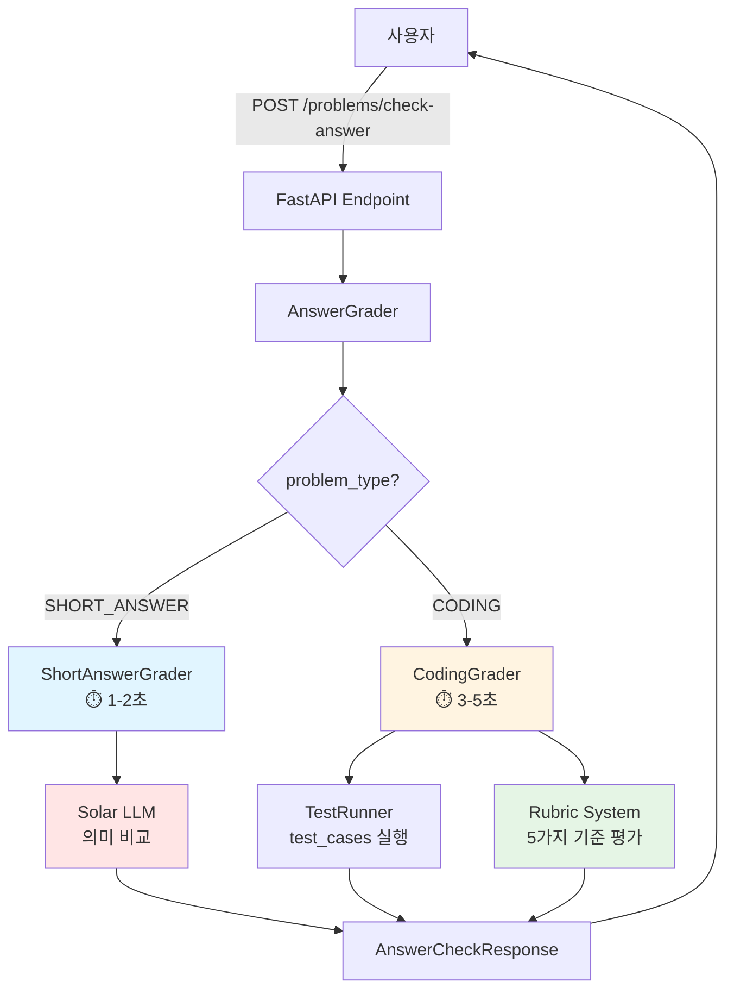
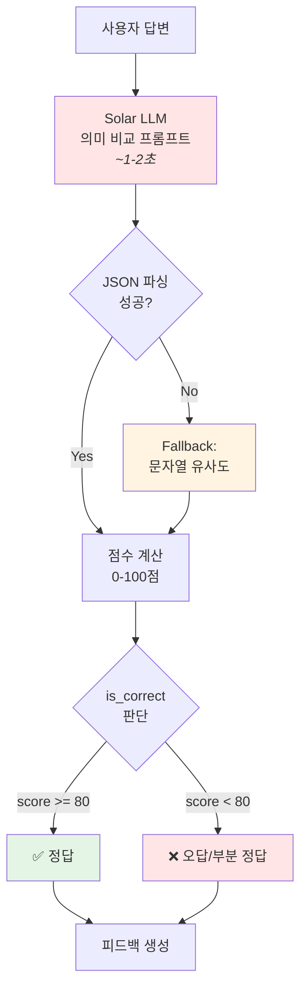
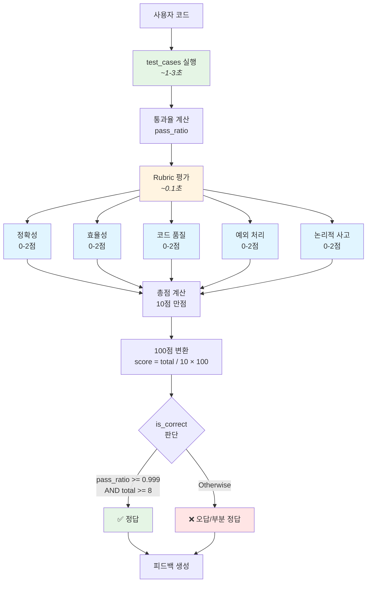

# Grading System - 답변 검증 시스템

자동 채점 시스템 문서

---

## 시스템 개요

사용자가 생성된 문제에 대한 답변을 제출하면, 문제 타입(`SHORT_ANSWER`, `CODING`)에 따라 자동으로 채점하는 시스템입니다.

### 핵심 기능

- **SHORT_ANSWER**: LLM 기반 의미적 유사도 평가
- **CODING**: 루브릭 기반 5가지 기준 평가 (정확성, 효율성, 코드 품질, 예외 처리, 논리적 사고)
- **부분 점수**: 0-100점 범위의 세밀한 점수 부여
- **상세 피드백**: 왜 정답/오답인지 구체적 설명

---

## 아키텍처



---

## SHORT_ANSWER 채점 알고리즘

### 개요

LLM(Solar-1-mini-chat)을 사용해 정답과 사용자 답변의 **의미적 유사도**를 평가합니다.

### 채점 프로세스



### 점수 기준

| 점수 범위 | 판정 | 설명 |
|----------|------|------|
| 100점 | 완전 정답 | 핵심 개념을 모두 정확히 설명 (표현은 달라도 됨) |
| 80-90점 | 정답 | 핵심 개념은 맞지만 일부 설명 부족 |
| 50-70점 | 부분 정답 | 일부 개념만 포함 |
| 30-40점 | 부분 오답 | 방향은 맞지만 구체성 부족 |
| 0-20점 | 오답 | 핵심 개념 누락 또는 잘못된 정보 |

### 예시

**문제**: Observer 패턴이란 무엇인가요?
**정답**: 객체의 상태 변화를 관찰자에게 자동으로 알려주는 디자인 패턴입니다.

| 사용자 답변 | 점수 | 판정 | 이유 |
|------------|------|------|------|
| "상태가 바뀌면 observer에게 알림을 보내는 패턴" | 95점 | ✅ 정답 | 핵심 개념 정확히 포함 |
| "상태 변화를 알려주는 패턴" | 60점 | ⚠️ 부분 정답 | "관찰자" 개념 누락 |
| "객체를 생성하는 패턴" | 10점 | ❌ 오답 | 잘못된 개념 |

### Fallback 메커니즘

LLM 호출 실패 시 문자열 유사도로 폴백:
- 정확히 일치: 100점
- 부분 포함: 80점
- 불일치: 0점

---

## CODING 채점 알고리즘

### 개요

**루브릭 기반 5가지 기준**으로 코드를 평가합니다:

1. **정확성** (Accuracy): 테스트 통과율
2. **효율성** (Efficiency): 실행 시간 대비 제한
3. **코드 품질** (Code Quality): 가독성, 구조, 안전성
4. **예외 처리** (Exception Handling): 오류 처리 로직
5. **논리적 사고** (Logical Reasoning): 요구사항 충족도

각 항목은 **0-2점** (총 10점 만점) → 100점 만점으로 변환

### 채점 프로세스



### 루브릭 상세 기준

#### 1. 정확성 (Accuracy)

| 점수 | 기준 | 설명 |
|------|------|------|
| 2점 | 100% 통과 | 모든 테스트 케이스 통과 |
| 1점 | 50% 이상 | 절반 이상 테스트 통과 |
| 0점 | 50% 미만 | 대부분 테스트 실패 |

#### 2. 효율성 (Efficiency)

| 점수 | 기준 | 설명 |
|------|------|------|
| 2점 | 실행 시간 ≤ 50% 제한 | 실행 시간이 여유로움 |
| 1점 | 실행 시간 ≤ 90% 제한 | 실행 시간 제한의 90% 이하 |
| 0점 | 실행 시간 > 90% 제한 | 실행 시간이 제한에 근접 |

#### 3. 코드 품질 (Code Quality)

| 점수 | 기준 | 설명 |
|------|------|------|
| 2점 | 양호 | 가독성 좋고, 120자 이하 라인, 공백 적절 |
| 1점 | 보통 | 일부 긴 라인(120자 초과) 또는 탭 사용 |
| 0점 | 불량 | eval/exec 사용, TODO 포함, 과도한 길이(400줄 초과) |

#### 4. 예외 처리 (Exception Handling)

| 점수 | 기준 | 설명 |
|------|------|------|
| 2점 | 명시적 처리 | try/except/raise 사용 |
| 1점 | 암묵적 처리 | 예외 처리 문은 없지만 테스트 통과 |
| 0점 | 예외 발생 | 테스트 중 예외 발생 |

#### 5. 논리적 사고 (Logical Reasoning)

| 점수 | 기준 | 설명 |
|------|------|------|
| 2점 | 완전 충족 | 모든 테스트 통과 + 코드 품질 우수 |
| 1점 | 부분 충족 | 일부 테스트 통과, 개선 여지 있음 |
| 0점 | 미충족 | 논리 오류로 요구사항 불충족 |

### 예시

**문제**: 두 수를 더하는 함수 `add(a, b)` 작성

**정답 코드** (90점):
```python
def add(a, b):
    return a + b
```

| 기준 | 점수 | 이유 |
|------|------|------|
| 정확성 | 2/2 | 모든 테스트 통과 |
| 효율성 | 2/2 | 실행 시간 여유로움 |
| 코드 품질 | 2/2 | 가독성 양호 |
| 예외 처리 | 1/2 | 예외 처리 문은 없지만 테스트 통과 |
| 논리적 사고 | 2/2 | 요구사항 완전 충족 |
| **총점** | **9/10** | **90점** |

**오답 코드** (30점):
```python
def add(a, b):
    return a * b  # 곱셈 사용 (오답)
```

| 기준 | 점수 | 이유 |
|------|------|------|
| 정확성 | 0/2 | 대부분 테스트 실패 |
| 효율성 | 2/2 | 실행 시간 여유로움 |
| 코드 품질 | 2/2 | 가독성 양호 |
| 예외 처리 | 1/2 | 예외 처리 문은 없지만 실행됨 |
| 논리적 사고 | 0/2 | 논리 오류 (덧셈이 아닌 곱셈) |
| **총점** | **5/10** | **50점** |

### 보안 고려사항

#### 위험한 코드 실행 방지

1. **제한된 빌트인 함수**: 안전한 함수만 허용 (`abs`, `len`, `sum` 등)
2. **위험 함수 차단**: `eval`, `exec`, `open`, `import` 등 차단
3. **타임아웃 설정**: 5초 제한 (무한 루프 방지)
4. **코드 품질 검사**: `eval`/`exec` 사용 시 0점 처리

#### 안전한 실행 환경

```python
# 허용된 빌트인만 사용
safe_builtins = {
    "abs", "all", "any", "bool", "dict", "enumerate",
    "filter", "float", "int", "len", "list", "map",
    "max", "min", "range", "reversed", "round",
    "set", "sorted", "str", "sum", "tuple", "zip"
}

exec_globals = {"__builtins__": safe_builtins}
exec(user_code, exec_globals, {})
```

---

## API 사용법

### Endpoint

```
POST /problems/check-answer
```

### Request

```json
{
  "problem": {
    "question": "Observer 패턴이란?",
    "answer": "객체의 상태 변화를 관찰자에게 알려주는 패턴",
    "hints": ["상태 변화", "자동 통지"],
    "difficulty_score": 1,
    "problem_type": "SHORT_ANSWER",
    "test_cases": []
  },
  "user_answer": "상태가 바뀌면 observer에게 알림을 보내는 패턴"
}
```

### Response (SHORT_ANSWER)

```json
{
  "is_correct": true,
  "score": 95,
  "feedback": "핵심 개념을 정확히 이해하고 있습니다. '자동 통지' 개념이 잘 표현되었습니다.",
  "correct_answer": null,
  "similarity_score": 0.95,
  "rubric_scores": null,
  "test_results": null,
  "response_time_ms": 1200
}
```

### Response (CODING)

```json
{
  "is_correct": true,
  "score": 90,
  "feedback": "✅ 정답입니다!\n\n📊 테스트 통과: 4/4\n\n📝 평가 기준:\n  - 정확성: 2/2점 - 모든 테스트 통과\n  - 효율성: 2/2점 - 실행 시간이 여유롭습니다\n  - 코드 품질: 2/2점 - 가독성 양호\n  - 예외 처리: 1/2점 - 예외 처리 문은 없지만 테스트를 통과\n  - 논리적 사고: 2/2점 - 요구사항을 완전히 충족하는 논리",
  "correct_answer": null,
  "similarity_score": null,
  "rubric_scores": {
    "accuracy": {"label": "정확성", "score": 2, "max_score": 2, "reason": "모든 테스트 통과"},
    "efficiency": {"label": "효율성", "score": 2, "max_score": 2, "reason": "실행 시간이 여유롭습니다"},
    "code_quality": {"label": "코드 품질", "score": 2, "max_score": 2, "reason": "가독성 양호"},
    "exception_handling": {"label": "예외 처리", "score": 1, "max_score": 2, "reason": "예외 처리 문은 없지만 테스트를 통과"},
    "logical_reasoning": {"label": "논리적 사고", "score": 2, "max_score": 2, "reason": "요구사항을 완전히 충족하는 논리"}
  },
  "test_results": [
    {"test_id": 1, "input": {"a": 1, "b": 2}, "expected": 3, "actual": 3, "passed": true, "runtime_sec": 0.001},
    {"test_id": 2, "input": {"a": 5, "b": 10}, "expected": 15, "actual": 15, "passed": true, "runtime_sec": 0.001}
  ],
  "response_time_ms": 3500
}
```

### cURL 예시

#### SHORT_ANSWER 채점

```bash
curl -X POST http://localhost:8000/problems/check-answer \
  -H "Content-Type: application/json" \
  -d '{
    "problem": {
      "question": "Observer 패턴이란?",
      "answer": "객체의 상태 변화를 관찰자에게 알려주는 패턴",
      "problem_type": "SHORT_ANSWER",
      "hints": ["상태 변화"],
      "difficulty_score": 1,
      "test_cases": []
    },
    "user_answer": "상태가 바뀌면 observer에게 알림 보내는 패턴"
  }'
```

#### CODING 채점

```bash
curl -X POST http://localhost:8000/problems/check-answer \
  -H "Content-Type: application/json" \
  -d '{
    "problem": {
      "question": "두 수를 더하는 함수 add(a, b) 작성",
      "answer": "def add(a, b):\n    return a + b",
      "problem_type": "CODING",
      "hints": ["return 사용"],
      "difficulty_score": 4,
      "test_cases": [
        {"input": {"a": 1, "b": 2}, "expected_output": 3},
        {"input": {"a": 5, "b": 10}, "expected_output": 15}
      ]
    },
    "user_answer": "def add(a, b):\n    return a + b"
  }'
```

---

## 성능 메트릭

### 응답 시간

| 문제 타입 | 평균 응답 시간 | 주요 작업 |
|----------|--------------|----------|
| **SHORT_ANSWER** | 1-2초 | LLM 의미 비교 |
| **CODING** | 3-5초 | test_cases 실행 + 루브릭 평가 |

### 처리 단계별 시간

**SHORT_ANSWER**:
- LLM 호출: ~1-2초
- JSON 파싱: ~0.01초
- 피드백 생성: ~0.01초

**CODING**:
- test_cases 실행: ~1-3초 (테스트 개수에 비례)
- 루브릭 평가: ~0.1초
- 피드백 생성: ~0.01초

---

## 테스트

### 실행 방법

```bash
# 답변 검증 시스템 테스트
python scripts/test_answer_grading.py
```

### 테스트 케이스

- **SHORT_ANSWER**: 정답, 부분 정답, 오답
- **CODING**: 정답 코드, 오답 코드, 비효율적 코드, 위험한 코드
- **엣지 케이스**: 빈 답변, eval 사용, 무한 루프 등

---

## 파일 구조

```
paper_problem/
├── graders/                    # 채점 시스템
│   ├── __init__.py
│   ├── answer_grader.py       # 통합 채점기
│   ├── short_answer_grader.py # 단답형 채점기
│   ├── coding_grader.py       # 코딩 채점기
│   └── grader_rubric.py       # 루브릭 시스템 (5가지 기준)
├── models.py                   # AnswerCheckRequest/Response
├── api.py                      # POST /check-answer
└── ...

scripts/
└── test_answer_grading.py     # 채점 테스트
```

---

## 향후 개선 방향

### 1. 채점 정확도 향상

- **LLM 프롬프트 개선**: 더 구체적인 평가 기준 제시
- **부분 점수 세분화**: 50-70점 범위를 더 세밀하게 구분
- **컨텍스트 활용**: 문제의 난이도, 힌트를 채점에 반영

### 2. 보안 강화

- **Docker 샌드박스**: 코드 실행을 격리된 컨테이너에서 실행
- **RestrictedPython**: 더 안전한 Python 실행 환경
- **메모리 제한**: 코드 실행 시 메모리 사용량 제한

### 3. 성능 최적화

- **LLM 캐싱**: 동일한 질문/답변에 대한 결과 캐싱
- **병렬 테스트 실행**: 여러 test_cases를 병렬로 실행
- **응답 시간 단축**: 타임아웃을 더 짧게 (3초로 단축)

### 4. 기능 확장

- **다국어 지원**: 영어, 일본어 등 다국어 답변 채점
- **코드 스타일 검사**: PEP8, ESLint 등 스타일 가이드 준수 체크
- **AI 코멘트**: 코드 개선 방향 제안
- **학습 경로 추천**: 오답 패턴 분석 후 학습 자료 추천
