# Problem Generation System - LangGraph Workflow

LLM 기반 학습 문제 자동 생성 시스템의 LangGraph 워크플로우

---

## Problem Workflow (개선됨 ✨)

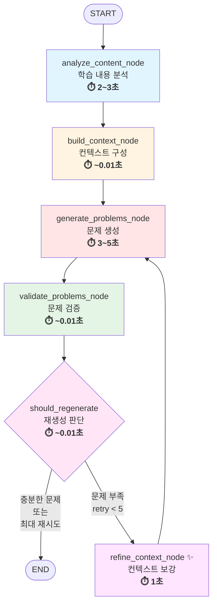

### 성능 지표

| 단계 | 평균 시간 | 주요 작업 | 비고 |
|------|---------|----------|------|
| **Analyze** | 2~3초 | LLM 토픽 추출 + ChromaDB 검색 | 토픽 제공시 ~0.2초 |
| **Build** | ~0.01초 | 라운드 로빈 컨텍스트 구성 | 빠른 텍스트 처리 |
| **Generate** | 3~5초 | Solar LLM 문제 생성 | 난이도/개수 영향 |
| **Validate** | ~0.01초 | 검증 로직 실행 | 빠른 규칙 검사 |
| **Decision** | ~0.01초 | 재생성 판단 | 조건 체크만 |
| **Total (1회)** | **5~8초** | 재시도 없이 성공 | |
| **Total (재시도)** | **10~25초** | 최대 5회 재시도 포함 | retry_count 영향 |

---

## State: ProblemState

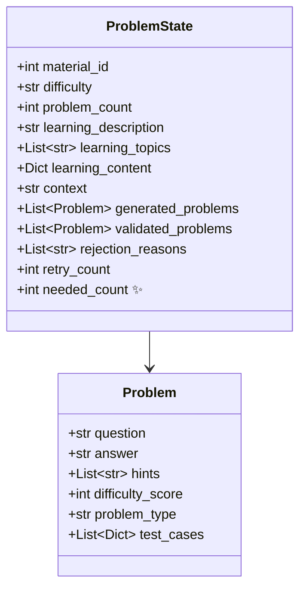

---

## 노드 1: analyze_content_node (⏱️ 2~3초)

### 학습 내용 분석

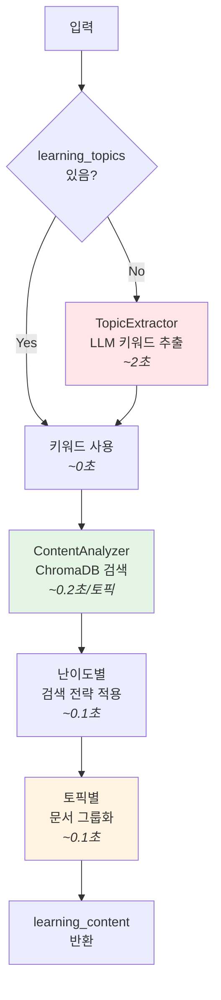

**세부 처리 단계**:
1. **토픽 추출** (~2초 or ~0초): LLM으로 키워드 추출 (이미 제공되면 스킵)
2. **ChromaDB 검색** (~0.2초/토픽): 각 토픽별로 관련 문서 검색
3. **난이도별 전략 적용** (~0.1초): BEGINNER 5개, INTERMEDIATE 7개, ADVANCED 10개
4. **문서 그룹화** (~0.1초): 토픽별로 검색 결과 정리

### 주제 추출 과정

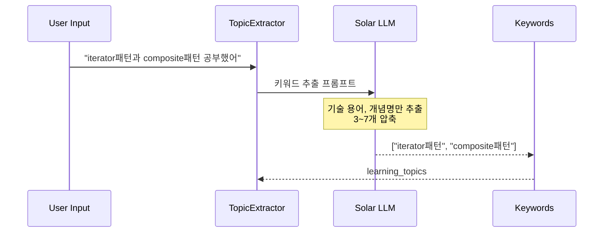

### 난이도별 검색 전략

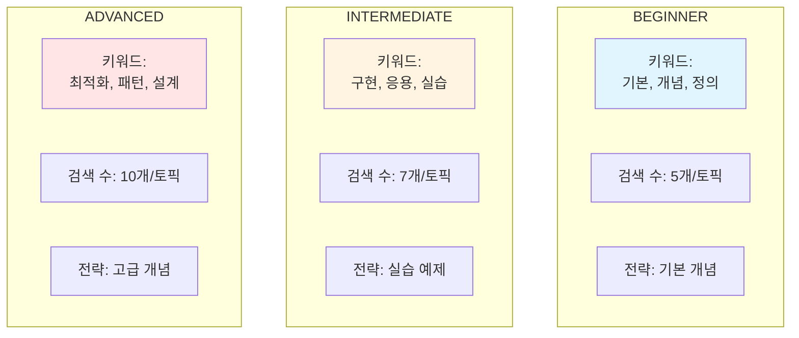

### 토픽별 문서 그룹화

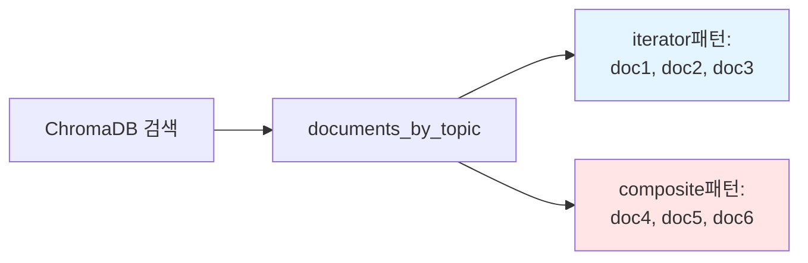

---

## 노드 2: build_context_node

### 라운드 로빈 방식 균등 분배

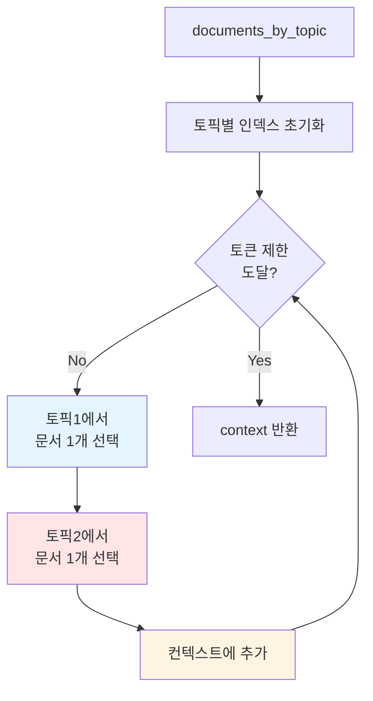

### 균등 분배 예시

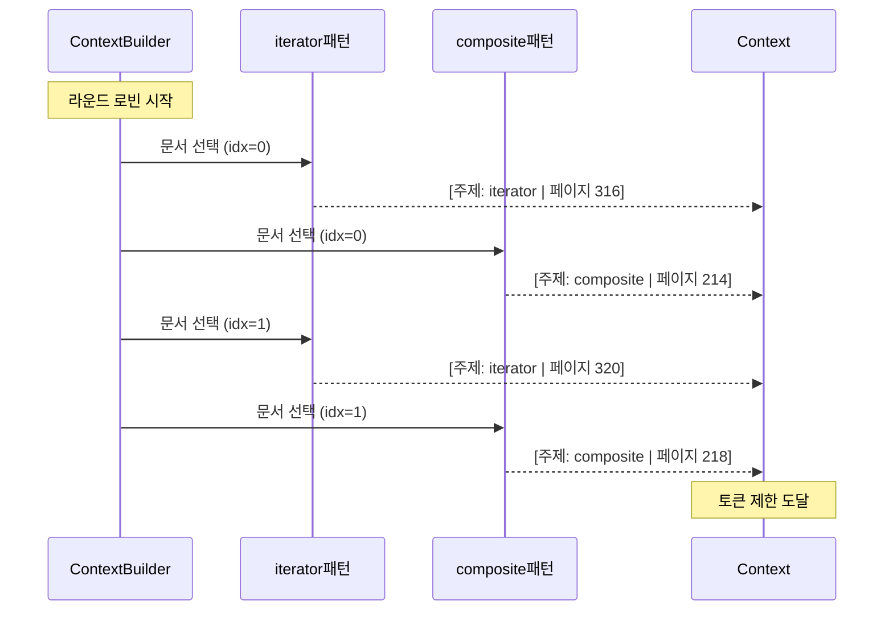

### 토픽 편향 방지

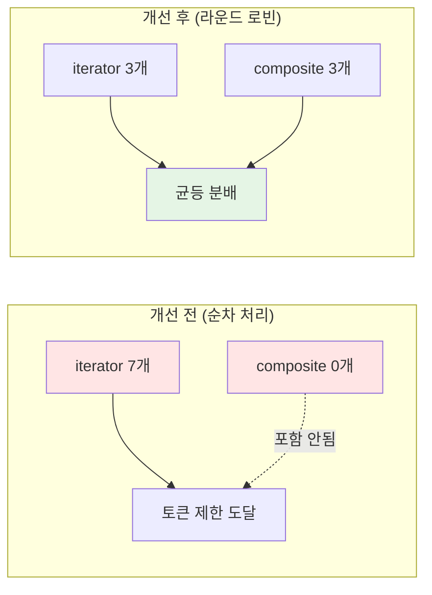

---

## 노드 3: generate_problems_node (⏱️ 3~5초)

### 난이도별 생성기 선택

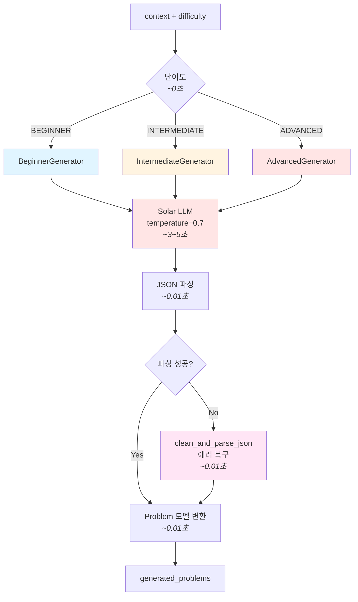

**세부 처리 단계**:
1. **Generator 선택** (~0초): 난이도에 따른 조건 분기
2. **프롬프트 구성** (~0.01초): 컨텍스트 + 난이도별 프롬프트 템플릿
3. **LLM 생성** (~3-5초): Solar-1-mini-chat으로 JSON 형태 문제 생성
4. **JSON 파싱** (~0.01초): 응답을 Python 딕셔너리로 변환 (에러 복구 포함)
5. **모델 변환** (~0.01초): Problem 모델 객체로 변환

### 난이도별 문제 유형

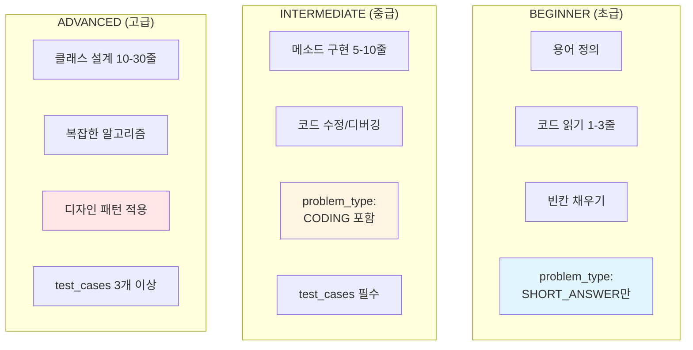

### 문제 생성 과정

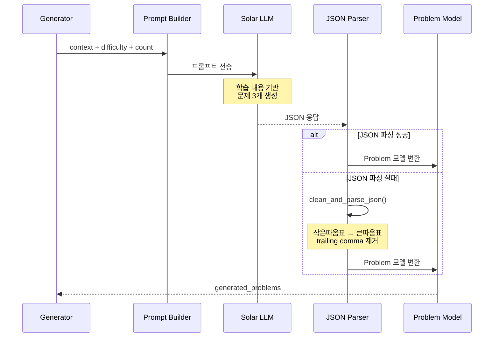

---

## 노드 4: validate_problems_node

### 검증 프로세스

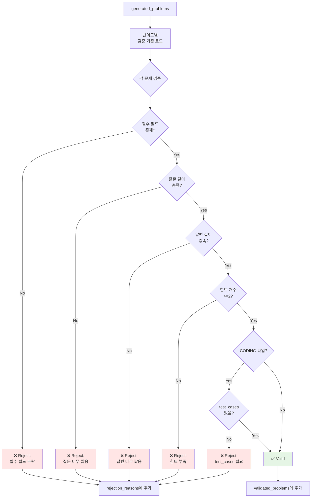

### 난이도별 검증 기준

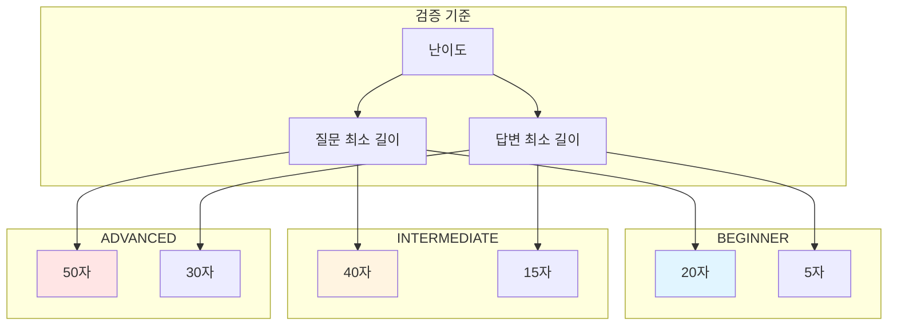

### 누적 검증 방식

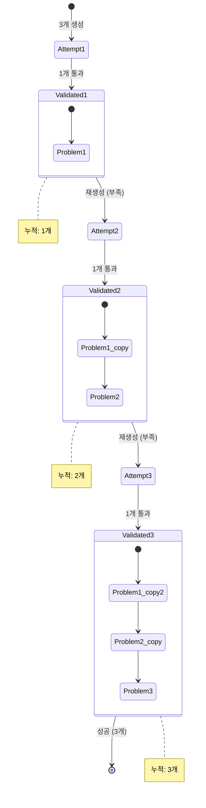

---

## 노드 5: should_regenerate (조건부 엣지)

### 재생성 판단 로직

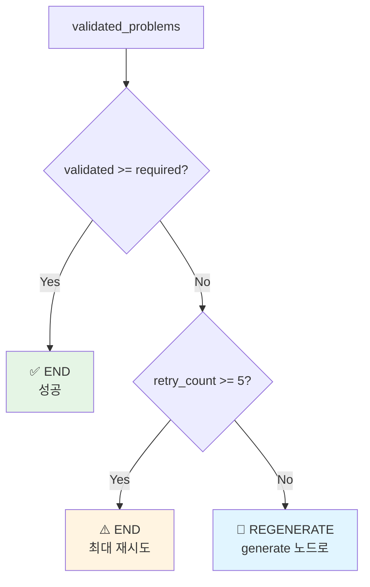

### 재생성 흐름 예시

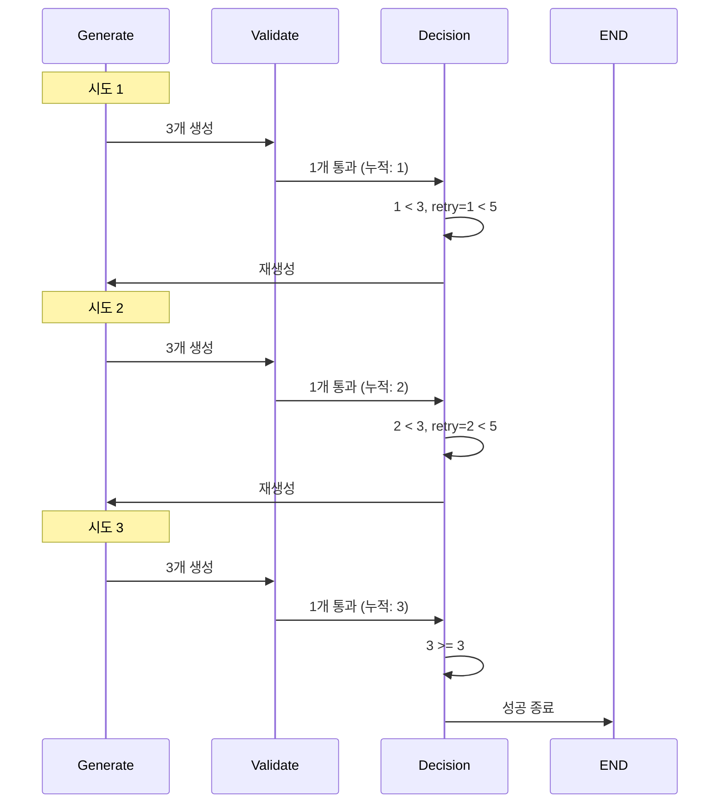

### 최대 재시도 예시

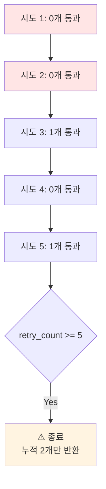

---

## 노드 6: refine_context_node (⏱️ 1초) ✨

### 컨텍스트 보강 과정

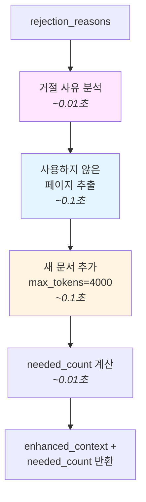

**처리 내용:**
1. **거절 사유 분석**: rejection_reasons 로깅 (처음 3개)
2. **사용하지 않은 페이지 추출**: 기존 context에서 이미 사용한 페이지 제외
3. **컨텍스트 보강**: 새 문서를 추가하여 enhanced_context 생성 (max 4000 토큰)
4. **필요 개수 계산**: `needed_count = problem_count - len(validated_problems)`

**개선 효과:**
- **다양성**: 매번 같은 context 재사용 X → 새 문서로 다양한 문제 생성
- **효율성**: 필요한 개수만 생성 (3개 중 1개 통과 → 2개만 생성)
- **품질**: rejection_reasons 로깅으로 개선 방향 파악

---

## 전체 시스템 아키텍처

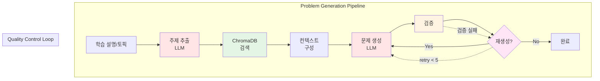

---

## 성능 최적화

### 토픽 균등 분배 효과

```mermaid
graph LR
    subgraph "개선 전"
        A1[Context 구성] --> A2[Iterator 7개<br/>Composite 0개]
        A2 --> A3[생성된 문제<br/>Iterator 3개<br/>Composite 0개]
    end

    subgraph "개선 후"
        B1[Context 구성<br/>라운드 로빈] --> B2[Iterator 3개<br/>Composite 3개]
        B2 --> B3[생성된 문제<br/>Iterator 1-2개<br/>Composite 1-2개]
    end

    style A2 fill:#ffe5e5
    style A3 fill:#ffe5e5
    style B2 fill:#e5f5ff
    style B3 fill:#e5f5e5
```

### 검증 기준 차등 효과

```mermaid
graph TB
    subgraph "개선 전 (동일 기준)"
        A1[모든 난이도<br/>질문 50자 이상]
        A1 --> A2[초급 용어 정의<br/>12자]
        A2 --> A3[❌ Reject]
        A3 --> A4[무한 재생성]
    end

    subgraph "개선 후 (차등 기준)"
        B1[BEGINNER: 20자<br/>INTERMEDIATE: 40자<br/>ADVANCED: 50자]
        B1 --> B2[초급 용어 정의<br/>25자]
        B2 --> B3[✅ Valid]
        B3 --> B4[성공 생성]
    end

    style A3 fill:#ffe5e5
    style A4 fill:#ffe5e5
    style B3 fill:#e5f5e5
    style B4 fill:#e5f5e5
```

---

## 데이터 흐름

```mermaid
stateDiagram-v2
    [*] --> Input: learning_description
    Input --> TopicExtract: "iterator패턴 공부"
    TopicExtract --> Search: ["iterator패턴"]
    Search --> Context: documents_by_topic
    Context --> Generate: context (2000자)
    Generate --> Validate: 3 problems

    state Validate {
        [*] --> Check1
        Check1 --> Check2
        Check2 --> [*]
    }

    Validate --> Decision: validated + rejected

    state Decision <<choice>>
    Decision --> Generate: retry < 5 && valid < required
    Decision --> [*]: valid >= required || retry >= 5

    note right of TopicExtract
        LLM 키워드 추출
    end note

    note right of Context
        라운드 로빈 분배
    end note

    note right of Validate
        난이도별 검증
    end note
```

---

## 컴포넌트 다이어그램

```mermaid
graph TB
    subgraph "External Services"
        US[Upstage API<br/>- Solar LLM<br/>- Embedding]
        CH[ChromaDB<br/>Vector Store]
    end

    subgraph "paper_problem Module"
        WF[workflow.py<br/>LangGraph]
        GEN[generators/<br/>beginner.py<br/>intermediate.py<br/>advanced.py]
        UTL[utils/<br/>topic_extractor.py<br/>content_analyzer.py<br/>context_builder.py]
        VAL[validators/<br/>problem_validator.py]
        API[api.py<br/>FastAPI Routes]
    end

    subgraph "shared Module"
        UC[upstage_client.py]
        CC[chroma_client.py]
    end

    API --> WF
    WF --> GEN
    WF --> UTL
    WF --> VAL
    GEN --> UC
    UTL --> UC
    UTL --> CC
    UC --> US
    CC --> CH

    style US fill:#ffe5e5
    style CH fill:#e5f5e5
    style WF fill:#fff4e1
    style GEN fill:#e1f5ff
```

---

## Grading Workflow (새로 추가 ✨)

답변 채점을 위한 LangGraph 워크플로우

```mermaid
graph TD
    Start([START]) --> ValidateInput[validate_input_node<br/>입력 검증<br/><b>⏱️ 0.1초</b>]
    ValidateInput --> Grade[grade_answer_node<br/>채점 실행<br/><b>⏱️ 0.5~2초</b>]
    Grade --> Verify[verify_result_node<br/>결과 검증<br/><b>⏱️ 0.1초</b>]

    Verify --> Decision{신뢰도<br/>충분?}
    Decision -->|Yes| End([END])
    Decision -->|No<br/>retry < 2| Grade

    style ValidateInput fill:#e1f5ff
    style Grade fill:#ffe5e5
    style Verify fill:#e5f5e5
    style Decision fill:#ffe5f5
```

### 성능 지표

| 단계 | 평균 시간 | 주요 작업 |
|------|---------|----------|
| **Validate Input** | 0.1초 | 빈 답변 체크 + 문제 타입 검증 |
| **Grade** | 0.5~2초 | SHORT_ANSWER (LLM) / CODING (실행) |
| **Verify** | 0.1초 | confidence_score 검증 (≥ 0.3) |
| **Total** | **0.5~2.5초** | 초기 채점 + 재채점 시 +0.5초 |

---

### State: GradingState

```mermaid
classDiagram
    class GradingState {
        +Problem problem
        +str user_answer
        +Dict grading_result
        +bool is_verified
        +int retry_count
        +float confidence_score ✨
    }
```

**핵심 필드:**
- `confidence_score`: LLM 채점 신뢰도 (0.0~1.0, similarity_score 기반)
- `is_verified`: 검증 통과 여부 (confidence ≥ 0.3 and 점수 범위 유효)

---

### 노드 1: validate_input_node

```mermaid
flowchart TD
    A[problem + user_answer] --> B{빈 답변?}
    B -->|Yes| C[score=0<br/>is_verified=True]
    B -->|No| D{유효한<br/>problem_type?}
    D -->|No| E[에러 메시지<br/>is_verified=True]
    D -->|Yes| F[검증 통과]

    style C fill:#ffe5e5
    style E fill:#ffe5e5
    style F fill:#e5f5e5
```

**처리 내용:**
- 빈 답변 조기 필터링 (LLM 호출 방지)
- 문제 타입 검증 (SHORT_ANSWER/CODING)
- is_verified=True 설정 시 grade 노드 스킵

---

### 노드 2: grade_answer_node

```mermaid
flowchart TD
    A[problem + user_answer] --> B{problem_type}
    B -->|SHORT_ANSWER| C[ShortAnswerGrader<br/>LLM 의미 유사도]
    B -->|CODING| D[CodingGrader<br/>코드 실행]
    C --> E[grading_result +<br/>confidence_score]
    D --> E

    style C fill:#e1f5ff
    style D fill:#ffe5e5
```

**채점자:**
- **ShortAnswerGrader**: LLM으로 similarity_score 계산
- **CodingGrader**: 실제 코드 실행 + 테스트 케이스 검증

---

### 노드 3: verify_result_node

```mermaid
flowchart TD
    A[grading_result] --> B{confidence<br/>< 0.3?}
    B -->|Yes| C[is_verified=False<br/>재채점 필요]
    B -->|No| D{점수 범위<br/>0~100?}
    D -->|No| E[is_verified=False]
    D -->|Yes| F[is_verified=True]

    style C fill:#ffe5e5
    style E fill:#ffe5e5
    style F fill:#e5f5e5
```

**검증 항목:**
1. confidence_score ≥ 0.3
2. 0 ≤ score ≤ 100
3. 필수 필드 존재

---

### 조건부 분기

```python
def should_retry(state: GradingState) -> str:
    if state["is_verified"]:
        return "end"

    if state["retry_count"] >= 2:
        return "end"  # 최대 재시도

    return "retry"  # 재채점
```

**재채점 조건:**
- 신뢰도 낮음 (< 0.3)
- 점수 범위 오류
- 최대 2회까지 재시도

